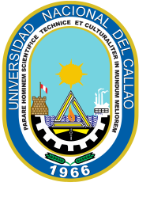

# el_renacimiento
Trabajo del curso de actividades culturales en la carrera de ingeniería de sistemas.

## Problema detectado: citas en `?`
Si al compilar ves los autores/años como `?`, la causa es que **no se ejecuta la etapa bibliográfica**. El fichero `main.bbl` se genera con `bibtex` (o `biber`) a partir de `Monografia/bib/referencias.bib`; si omites ese paso, el PDF no encuentra las entradas y deja las citas sin resolver.

Para corregirlo:
1. Asegúrate de que MiKTeX tiene instalado `bibtex` (Texmaker lo trae listo por defecto).
2. Compila en un flujo que incluya `bibtex` después del primer `pdflatex`.

## Cómo compilar la monografía
La carpeta `Monografia` contiene el proyecto LaTeX.

### Con Texmaker (Windows)
1. Abre **Options → Configure Texmaker → Quick Build**.
2. Elige **User** y pega la tubería recomendada:
   ```
   pdflatex -synctex=1 -interaction=nonstopmode %.tex|bibtex %|pdflatex -synctex=1 -interaction=nonstopmode %.tex|pdflatex -synctex=1 -interaction=nonstopmode %.tex
   ```
3. Guarda y usa **Quick Build** sobre `main.tex`. Esto creará `main.bbl` y las citas saldrán con autor y año.

También puedes copiar este flujo desde `Monografia/texmaker_quickbuild.txt`.

### Opción rápida con `latexmk`
Si tienes `latexmk` instalado, ejecuta en la raíz del proyecto:
```bash
cd Monografia
latexmk -pdf main.tex
```

### Secuencia manual
Si no tienes `latexmk`, compila en este orden desde `Monografia`:
```bash
pdflatex main.tex
bibtex main
pdflatex main.tex
pdflatex main.tex
```

### Ruta de la bibliografía
El archivo de referencias está en `Monografia/bib/referencias.bib` y se incluye en `main.tex` con:
```latex
\bibliographystyle{apacite}
\bibliography{bib/referencias}
```

## Imágenes de la monografía
Algunas figuras incluidas en el proyecto:




